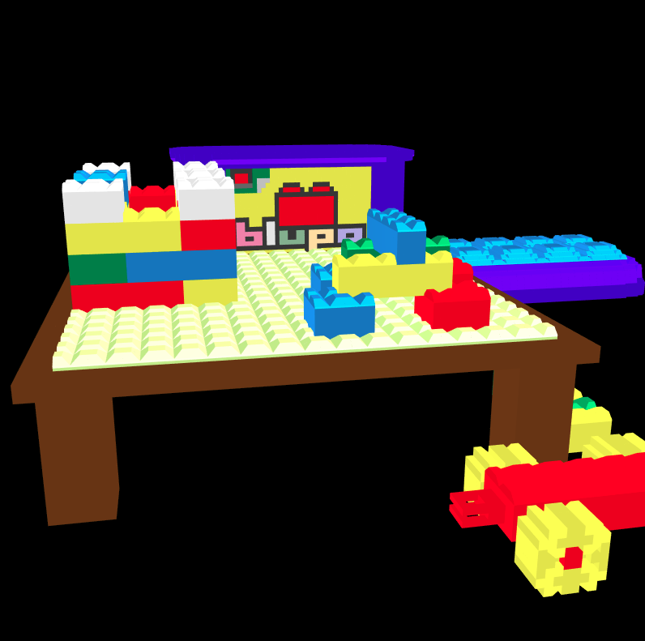

# Blockland WebGL Renderer

This is a WebGL renderer for [Blockland](http://blockland.us/) save files.

It uses Blockland's native brick definition files (.blb) to render a save file (.bls). It is untested with the current version of Blockland. It's pretty unoptimized, but works okay for small- to medium-sized builds.
This was originally written back in 2014 as a weekend project for Nitramtj according to the file modification times. Don't expect quality code, I think this was my first forray into JavaScript.

## Running It

Since the blb files are loaded with `XMLHttpRequest`, you'll need to serve the directory with a web server - it's not enough to just download the repository and open index.html. It's currently hard-coded to load the save named "test_big.bls."